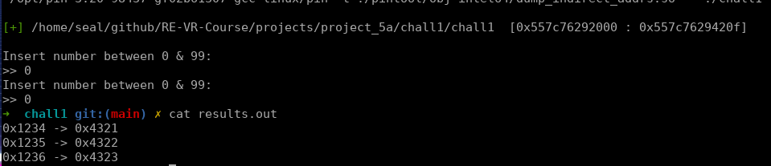
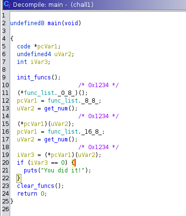

### Project 6 - Challenge 1

#### Instructions

In this assignment you will be using a combination of the intel-pin dbi engine, and the ghidra 
scripting api to automate a small feature that can frequently come in handy while reverse
engineering. The pass you will be writing will act on the provided test-case binary `chall1`. Your 
assignment is split into 2 main parts as detailed below.

#### Part 1:

In this part you will start by writing the custom pin pass. Write all your code for this section in
`pintool/dump_indirect_addrs.cpp`. You will be writing code for the 3 functions marked with a `TODO`
keyword. 

1. The `ImageLoad` function is responsible for extracting the start/end of the main executables
   memory section, and to do the small debug printout shown in the screenshot below. Your pass
   should only act on instructions from the main executable (performing it on all loaded libraries
   and other code takes too much time), so knowing the address range you are operating on is very
   important. Additionally your `results.out` file should use offsets from the binary base instead
   of the actually executed addresses since aslr makes the actual address unpredictable and harder
   to work with.

2. The `Instruction` function will be used to insert calls to `log_instr` at appropriate locations
   in the code. Make sure to properly verify that you are in the correct section and that you are
   dealing with an indirect function call since these are the only types of calls we care about in
   this pass.

3. The `log_instr` function takes the source address, and the address that is actually called as
   arguments, and pushes them to the `instr_trace` vector.

If you did everything right your `results.out` file should include 3 address pairs.

The result of this part should look something like the below screenshot upon execution, with the 
main part of the output being written to `results.out`, and a debug print that lists the address 
range of the main executable as shown below.



#### Part 2:

In this part you will be writing a short ghidra script to parse the previously created 
`results.out` file, and to comment the code in appropriate locations using it (indirect function
calls should be commented with the destination address of its dynamic call). After running your
script, the main function of the provided binary should look a little like the below screenshot
(obviously with the correct addresses). Nothing in this should be hardcoded (excluding the path to
ur results.out file), including the base address offsets. Use ghidra's api to find these and 
correctly calculate the addresses to make the insertions at.

Finally figure out what 2 numbers you need to provide to have the program print out the
success-message (this should now be trivial to do, even without a debugger), and add them as a
comment to your ghidra script.



##### Provided Files:
```
chall1          - This is the challenge binary you will be analyzing
Makefile        - Used to build/run the pintool (`make run` to run the tool)
pintool/dump_indirect_addrs.cpp     - This is the pintool script you will be writing
```

#### Install pin
```sh
# You can install this to eg. your home directory. It will require write permissions to this
# directory to complete compilation so don't install it to eg. /opt
wget https://software.intel.com/sites/landingpage/pintool/downloads/pin-3.20-98437-gf02b61307-gcc-linux.tar.gz
tar xf pin-3.20-98437-gf02b61307-gcc-linux.tar.gz

export PIN_ROOT=<path-to-pin-install>
```

#### Rubric
For full points, complete all of the parts listed for this assignment below. 
```
20%   Debug print identifying start/end of executable section using pin
40%   Completed pintool to correctly log addresses to results.out
30%   Ghidra Script correctly comments main function based on results.out 
10%   Found correct inputs to pass the check
```

For your final submission, upload a zip file that contains your pin pass (dump_indirect_addrs.cpp), 
and your ghidra script (ghidra.py) that also includes the challenge answers in its comments.

#### Additional Resources that may be helpful
```
# Documentation
```
https://software.intel.com/sites/landingpage/pintool/docs/98484/Pin/html/index.html         - Example pin passes
https://software.intel.com/sites/landingpage/pintool/docs/98650/Pin/doc/html/modules.html   - API Docs
https://www.intel.com/content/dam/develop/external/us/en/documents/cgo2013-256675.pdf       - Presentation
```
