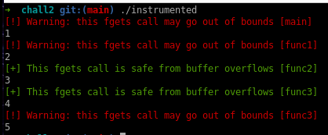

### Project 6 - Challenge 2

#### Instructions

In this assignment you will be using the llvm compiler-backend to instrument a program at
compile-time to insert functionality into the final program that goes beyond the initial source
code.

The pass you will be writing will act on the provided test-case `chall2.c`. Your assignment is to
write a compiler pass that transforms the original code so that each call to `fgets` that reads
bytes into a `malloc`-allocated buffer is bounds checked. This check is not supposed to abort
program execution. Instead it should just print out a message indicating if the corresponding call
to `fgets` is safe or not as indicated in the screenshot below.

You do not need to handle other allocation routines such as `calloc` or stack-allocated buffers,
similarly you do not need to consider other potentially out of bounds accessing functions such as
`memcpy`, only `fgets` is relevant for this assignment. Additionally, the goal of this assignment is
to write a pass that operates on individual functions, not entire programs, so you can assume that
all tested malloc/fgets call-combinations are made in the same function.



The encouraged approach for this assignment is to use the `helper.c` file to define a 
helper-function (eg. `void size_check(int allocated_bytes, int requested_bytes, char *func_name)`),
and then call out to this function from the llvm-code at the correct location with appropriate
arguments to perform the size-check and print out the results. If you want to explore a different
path towards achieving the same result, feel free to do so though (keeping academic honesty in mind,
copying an existing llvm pass that does something similar is not allowed).

##### Provided Files:
```
chall2_analysis - This directory contains the starter code for your pass and a cmake build-file
build_pass.sh   - Helper script to build the project
chall2.c        - Target against which your pass is ran
helper.c        - Use this to implement helper functions that you can call from your llvm pass
```

#### Install LLVM, Clang and other useful tools
```sh
# If you are not on Ubuntu 22.04, you may need to manually add the llvm-14 repository/use your
# respective package manager if you are using a different distro all-together
sudo apt install -y build-essential cmake llvm-14 llvm-14-dev llvm-14-tools clang-14
```

#### Compiling and running initial sample-pass
```sh
# Make sure to read this file and the added comments. Understanding how the build process works will
# help you debug errors that may come up with your pass

./build_pass.sh
```

#### Rubric
For full points, complete all of the parts listed for this assignment below. 
```
20%  Attach a screenshot `setup.png` that demonstrates that you can run the provided sample-pass
20%  Find all locations where a malloc-allocated buffer is used in the program
40%  Complete all parts of the assignment
10%  Attach a file `written.md` in which you explain how this pass could be modified to also find
     bugs in allocations that are made in a different function than the fgets call.
10%  To the `written.md` file, add another section in which you list 3 other pass-ideas that could
     be implemented to aid in automated bug-hunting/vulnerability research.
```

For your final submission, upload a zip file that contains your pass (chall2_analysis.cpp), your 
helper-file (helper.c), the setup.png screenshot, and written.md. Your pass will be tested against
the provided chall2.c file, and some other hidden tests (these will be very similar to chall2.c
though)

#### Additional Resources that may be helpful
```
# Documentation
https://llvm.org/doxygen/                            - General documentation
https://llvm.org/docs/LangRef.html                   - Reference for LLVM IR
https://llvm.org/docs/ProgrammersManual.html         - Describes some important classes/interfaces
https://llvm.org/docs/WritingAnLLVMPass.html         - Writing an LLVM pass tutorial 1
https://www.cs.cornell.edu/~asampson/blog/llvm.html  - Writing an LLVM pass tutorial 2
```
